# Parcours d'achat — carte cadeau B&Co

Breadboard de l'interaction structure and flow (technique : breadboarding, cf. `/layers-interaction-flow`).
Chaque **place** ci-dessous est un écran à part entière — pas une section de page défilante.
C'est la différence volontaire avec la référence (voir Sources) : là où Sephora/CashStar
tient tout sur une seule page longue avec des sections qui se révèlent, ici chaque décision
a son propre écran.

## Job story

En tant que client B&Co, je veux composer une carte cadeau — pour moi ou pour quelqu'un
d'autre — dans le mode de livraison qui m'arrange, la personnaliser simplement, et arriver
à un paiement en confiance, sans jamais me sentir face à un formulaire. Je veux aussi pouvoir
retrouver mes cartes cadeaux plus tard, même si je n'ai pas de compte.

## Sources

- Référence de structure : parcours cartes-cadeaux Sephora Canada par CashStar
  (`/Users/jcb/Downloads/dossier sans titre 4`).
- Différences voulues par rapport à la référence :
  1. Ajout d'un mode **retrait en salon** (absent chez Sephora).
  2. **Envoi postal conservé** en plus du retrait en salon — 3 modes de livraison au total :
     numérique, retrait en salon, envoi postal. Pas d'« impression à la maison ».
  3. Signature du message avec **alias / son nom / rien du tout** — absent chez Sephora
     (qui impose le nom de l'acheteur).
  4. **Un seul design de carte** — pas d'étape de choix de modèle, pas de choix de couleur.
     Supprime entièrement l'écran « Choisir un modèle » que Sephora place en tête de parcours.
  5. **Achat en invité + retrouver ses cartes sans compte** (lien envoyé par email) — absent
     chez Sephora, qui suppose un compte marchand classique.

---

## Décisions tranchées

| # | Décision | Choix retenu |
|---|---|---|
| 1 | Reprise du parcours si abandon | **Pas de reprise.** Rien n'est persisté avant le paiement ; si le visiteur quitte, il recommence. |
| 2 | Destinataires par commande | **1 destinataire par commande.** Pas de gestion de liste comme Sephora (15 max). |
| 3 | Paiement | **Simulé pour la démo.** Écran dédié avec un seul geste "Payer" qui simule un paiement réussi (ou un échec, pour tester le chemin d'erreur) — pas d'intégration Stripe/autre pour l'instant. L'écran reste conçu pour qu'un vrai prestataire s'y branche plus tard sans changer la structure du flow. |
| 4 | Compte requis pour acheter | **Achat en invité**, aucun compte nécessaire pour composer et payer une carte. |
| 5 | Retrouver ses cartes cadeaux | **Nouveau sous-parcours**, bouton en début (Landing) et en fin (Confirmation), menant à un choix : se connecter, ou recevoir un lien par email (sans compte). |
| 6 | Compte utilisé pour "Se connecter" | **Le même compte que b&co** (pas un compte séparé au site carte cadeau) — voir le constat technique ci-dessous, ce choix a une conséquence directe sur l'architecture. |
| 7 | Récap permanent cliquable ? | **Non, purement informatif.** Ne permet pas de sauter à une étape en cliquant dessus — évite le doublon avec les "Modifier" de l'écran Récapitulatif. |
| 8 | Auth partagée avec b&co (post-démo) | **Domaine parent commun + cookie de session partagé**, adossés à un backend d'auth centralisé (à construire) que les deux apps Next.js consomment. Pas de fusion des deux repos : chaque site reste déployé indépendamment, mais le cookie de session est posé sur le domaine parent (ex. `.bco.fr`) donc lisible par les deux. C'est le pattern standard pour du SSO entre sous-domaines/apps d'une même marque, cohérent avec la décision 6. |
| 9 | Sécurité du lien "Mes cartes cadeaux" | **Lien magique valable 15 minutes**, réutilisable pendant cette fenêtre (on peut rouvrir plusieurs cartes sans redemander), et à usage non exclusif (redemander un lien n'invalide pas l'accès en cours). Pattern passwordless standard — évite le compromis sécurité/friction d'un lien à usage unique pour un cas d'usage aussi bénin que "voir le statut d'une carte". |
| 10 | Vrai prestataire de paiement | **Stripe**, confirmé comme cible pour l'intégration réelle post-démo (Elements/Payment Request pour CB + Apple Pay/Google Pay). L'écran Paiement simulé (décision 3) est câblé pour que Stripe s'y substitue sans changer la structure du flow. |
| 11 | Geste de passage à "Récupérée" (retrait en salon) | **Code de retrait affiché au client** (référence de commande + QR) sur l'écran Confirmation et dans "Mes cartes cadeaux". Le personnel le scanne/saisit dans un outil interne (hors scope de ce document — pas un écran du site public) pour marquer la carte "Récupérée". |
| 12 | Frais de livraison (mode = postal) | **Frais fixe de 2 000 FCFA**, ajouté au montant de la carte sur le Récapitulatif et le Paiement (ligne dédiée + total). Ne fait pas partie de la valeur/solde de la carte cadeau elle-même — c'est un frais de service, pas un montant chargeable en boutique. |
| 13 | Zone de livraison couverte | **Quartiers de Dakar + Mbour**, choisis via un sélecteur dédié sur l'écran "Adresse de livraison" (pas de saisie libre de ville) — cohérent avec un service de coursier local plutôt qu'un envoi postal national. |
| 14 | Place de la prévisualisation 3D | **Écran dédié "Aperçu de la carte", juste avant Récapitulatif** (pas fondue dans l'écran Récapitulatif, pas avant que les données soient connues). Raisons : (a) le recto affiche le montant et le verso affiche message + signature — la carte ne peut être rendue fidèlement qu'une fois ces champs connus, donc pas plus tôt que la fin de la saisie ; (b) Récapitulatif reste l'écran transactionnel dense (lignes "Modifier", total, "Payer") — y ajouter un canvas 3D dilue le CTA de paiement et alourdit un écran déjà chargé ; (c) l'ordre "aperçu visuel émotionnel" → "relecture rationnelle avant paiement" suit un séquençage éprouvé pour un achat-cadeau (l'enthousiasme d'abord, la vérification des détails juste avant de payer). |
| 15 | Choix du salon (mode = retrait) | **Écran dédié "Choisir un salon", juste après Mode de livraison** (avant Montant) — deux salons pour l'instant : **Sea Plaza** et **Almadies**. Placé là plutôt qu'avec les coordonnées destinataire car c'est un attribut du mode choisi par l'acheteur (où le code de retrait sera présenté), pas une information sur le destinataire ; même pattern OptionCard que les autres choix binaires/ternaires du parcours (Mode de livraison, Pour qui ?, Quand l'envoyer ?). |
| 16 | Programmer une date, modes concernés | **Numérique et Livraison, pas Retrait en salon.** "Quand l'envoyer ?" s'ouvre pour les deux modes qui ont une notion de dispatch à une date choisie (email envoyé à une heure précise, colis expédié un jour précis) ; le retrait en salon en est exclu par choix produit — le code de retrait reste valable dès l'achat, sans date à cibler. |
| 17 | Destinataire, structure | **Un seul écran "Destinataire"** : **Prénom** + **Nom**, puis **Téléphone** + **Email** (au moins un des deux requis), quel que soit le mode de réception — le téléphone n'est plus réservé au mode retrait/postal (SMS, livreur), il est un canal de contact valable pour tous les modes au même titre que l'email. Fusionné depuis deux écrans séparés (revue UX du 2026-08-14, écrans jugés incohérents avec l'écran "Vos coordonnées" de l'acheteur, qui tient sur un seul écran pour la même quantité d'information) — mis en page en grille 2 colonnes (Prénom/Nom sur une ligne, Téléphone/Email sur l'autre, empilés en une colonne sur mobile) pour rester court sans risquer de faire défiler la page jusqu'au bouton "Continuer" ; même traitement 2 colonnes appliqué à "Vos coordonnées" pour la cohérence. |

### Constat technique — "le même compte que b&co"

`b&co/lib/account/persistence.ts` montre qu'**il n'existe pas encore de vrai backend d'authentification côté b&co** : `login()`/`logout()`/`isLoggedIn()` sont un mock entièrement front-end, stocké dans le `localStorage` du navigateur sous la clé `bco-account` (n'importe laquelle des 3 actions sur `/connexion` — email/mdp, Google, Apple — "connecte" l'utilisateur sans vérification). Ça change ce que "même compte" peut vouloir dire tant qu'on reste en démo :

- Le `localStorage` est **scopé par origine (domaine)**. Si le site carte cadeau reste un projet/déploiement séparé de b&co (ce qu'il est aujourd'hui : deux repos, deux `package.json` distincts), il ne peut pas lire le `bco-account` du site principal — il faudrait un vrai backend d'auth partagé, qui n'existe **ni côté b&co ni côté carte cadeau** pour l'instant.
- Si le site carte cadeau vivait **sous le même domaine/app que b&co** (ex. `b&co.com/carte-cadeau` au lieu d'un site séparé), il réutiliserait directement le même mock localStorage tel quel — cohérent pour une démo, mais implique de fusionner les deux projets Next.js.

**Décision prise pour la suite** : rester en deux projets séparés (pas de fusion de repo demandée), et reproduire ici le même mock que b&co (même forme de données, même clé de principe) pour que l'écran "Connexion" ait un comportement identique en démo. La vraie unification (backend d'auth partagé ou fusion des deux apps) reste une décision à prendre plus tard, quand on sortira de la phase démo — voir décisions ouvertes.

---

## Conventions transverses (tout le parcours d'achat, Mode de livraison → Paiement)

Deux éléments d'interface présents sur **chaque écran du parcours d'achat** — pas des affordances propres à un seul écran, donc factorisées ici plutôt que répétées dans chaque bloc du breadboard ci-dessous :

- **Revenir en arrière** — un lien texte, pas un bouton avec fond : une flèche + le label "Revenir en arrière", qui ramène à l'écran précédent tel que nommé par le "←" de chaque place. Données déjà saisies conservées (cf. discipline "retour arrière non destructif").
- **Récap permanent** — un encart en haut à droite, visible sur chaque écran, qui liste les décisions déjà validées (mode de livraison, montant, destinataire, etc.) au fur et à mesure qu'elles se prennent. Purement informatif, non cliquable (décision tranchée #7) — à ne pas confondre avec l'écran "Récapitulatif" en fin de parcours, qui reste l'étape de relecture complète avec "Modifier" avant paiement ; l'encart est son aperçu permanent, discret, pendant tout le trajet.

Ni l'un ni l'autre n'apparaît sur Landing (pas d'étape précédente, rien à récapituler) ni sur Confirmation (le parcours est terminé) ni dans le sous-parcours "Mes cartes cadeaux" (aucune décision d'achat n'y est prise).

---

## Vue d'ensemble (orientation seulement — le breadboard reste la référence)

```mermaid
graph LR
  A[Landing] --> B[Mode de livraison]
  A -.->|Voir mes cartes cadeaux| N[Mes cartes cadeaux — entrée]
  B -->|mode = retrait| B1[Choisir un salon]
  B1 --> C[Montant]
  B -->|mode != retrait| C[Montant]
  C --> D[Pour qui ?]
  D -->|pour quelqu'un d'autre| E[Destinataire]
  D -->|pour moi-même| G[Vos coordonnées]
  E -->|mode = postal| E1[Adresse de livraison]
  E -->|mode != postal| F[Message]
  E1 -->|pour quelqu'un d'autre| F
  F --> G
  G -->|pour quelqu'un d'autre| H[Signature]
  G -->|pour moi-même, mode = postal| E1
  G -->|pour moi-même, mode != postal| I{Retrait en salon ?}
  E1 -->|pour moi-même| I
  H --> I{Retrait en salon ?}
  I -->|non| J[Quand l'envoyer ?]
  I -->|oui| K0[Aperçu de la carte]
  J --> K0
  K0 --> K[Récapitulatif]
  K --> L[Paiement simulé]
  L --> M[Confirmation]
  L -->|échec simulé| L
  M -.->|Voir mes cartes cadeaux| N
  N --> O[Connexion]
  N --> P[Demander un lien]
  O --> Q[Mes cartes cadeaux — liste]
  P --> R[Lien envoyé]
  R -.->|clic sur le lien reçu| Q
```



---

## Breadboard — parcours d'achat

```
Landing (page marketing existante — Hero)
- "Composer ma carte" → Mode de livraison
- "Voir mes cartes cadeaux" → Mes cartes cadeaux — entrée
[ carte 3D, accroche, palette B&Co ]
```

```
Mode de livraison
- "Numérique" → Montant                    (mode = numérique)
- "Retrait en salon" → Choisir un salon     (mode = retrait)
- "Livraison" → Montant                     (mode = postal)
- ← Landing
[ 3 options avec description courte : délai, gratuité/frais, ce que reçoit le destinataire ]
```

```
Choisir un salon                              (seulement si mode = retrait)
- "Sea Plaza" → Montant
- "Almadies" → Montant
- ← Mode de livraison
[ 2 options, même pattern que les autres choix binaires du parcours (OptionCard) —
  détermine où le destinataire/l'acheteur viendra présenter le code de retrait ]
```

```
Montant
- montant prédéfini (x4) → Pour qui ?
- "Montant personnalisé" (champ + bornes min/max) → Pour qui ?
- ← Mode de livraison
[ Pas de choix de design ici ni ailleurs : design unique, non affiché comme décision ]
```

```
Pour qui ?
- "Pour quelqu'un d'autre" → Destinataire
- "Pour moi-même" → Vos coordonnées          (saute destinataire + message + signature)
- ← Montant
[ deux options, pas de formulaire sur cet écran ]
```

```
Destinataire                                  (seulement si "pour quelqu'un d'autre" — 1 destinataire)
- Continuer → Adresse de livraison (si mode = postal) / Message (sinon)
- ← Pour qui ?
[ Prénom + Nom, puis Téléphone + Email (au moins un des deux obligatoire, quel que soit
  le mode — voir décision 17) ; mise en page 2 colonnes (Prénom/Nom, Téléphone/Email),
  empilée en 1 colonne sur mobile — même traitement que "Vos coordonnées" ]
```

```
Adresse de livraison                          (seulement si mode = postal)
- Continuer → Message (venant de Destinataire) / Quand l'envoyer ? (venant de Vos coordonnées, "pour moi-même")
- ← Destinataire (venant de Destinataire) / Vos coordonnées (venant de Vos coordonnées)
[ quartier (sélecteur — quartiers de Dakar + Mbour) + adresse complète en texte libre
  (rue, bâtiment, étage, digicode...) — pensé pour qu'un livreur type coursier s'y retrouve,
  pas pour un envoi postal administratif. Même écran, mêmes champs, atteint depuis deux
  endroits : "pour quelqu'un d'autre" (après Destinataire) et "pour moi-même" avec livraison
  postale (après Vos coordonnées) — sans ça, un achat pour soi-même en livraison postale
  n'a nulle part où indiquer où expédier la carte. ]
```

```
Message                                       (facultatif)
- Continuer (même vide) → Vos coordonnées
- ← Adresse de livraison (si mode = postal) / Destinataire (sinon)
[ champ texte libre + compteur de caractères ]
```

```
Vos coordonnées                               (l'acheteur — toujours demandé, achat en invité)
- Continuer → Signature (pour quelqu'un d'autre)
             / Adresse de livraison (pour moi-même, mode = postal)
             / Quand l'envoyer ? (pour moi-même, mode ≠ postal et ≠ retrait)
             / Aperçu de la carte (pour moi-même, mode = retrait)
- ← Message (ou ← Pour qui ? si "pour moi-même")
[ Prénom + Nom, Téléphone + Email — tous obligatoires (contrairement au destinataire, où
  seul l'un des deux canaux est requis : l'acheteur est toujours le contact fiable pour
  le reçu et le suivi de commande) ; sert aussi à préremplir l'option "Mon nom" de l'écran
  Signature et à identifier ses cartes cadeaux plus tard (voir "Demander un lien") ]
```

```
Signature                                     (seulement si carte pour quelqu'un d'autre)
- "Un alias" (champ texte apparaît) → Quand l'envoyer ? / Récapitulatif
- "Mon nom" (préremplit avec le nom de l'écran précédent) → idem
- "Ne rien indiquer" → idem
- ← Vos coordonnées
[ 3 options à choix unique ]
```

```
Quand l'envoyer ?                             (tous les modes sauf retrait en salon)
- "Envoyer maintenant" / "Expédier maintenant" (postal) → Aperçu de la carte
- "Programmer" (date) → Aperçu de la carte
- ← Signature
[ sélecteur de date désactivé pour les dates passées ; libellés adaptés au mode
  (numérique = "envoyer", postal = "expédier") mais même écran et même pattern —
  voir décision 16 pour pourquoi retrait en salon est exclu ]
```

```
Aperçu de la carte
- "Voir le récapitulatif" → Récapitulatif
- ← dernier écran rempli (Quand l'envoyer ? / Signature / Vos coordonnées selon le mode)
[ prévisualisation 3D de la carte composée (recto + verso, les deux frames Figma), sur fond
  blanc, orbite libre à la souris/au doigt ; recto = montant, verso = message + signature
  (verso sans texte si "pour moi-même") — voir décision 14 pour la place de cet écran ]
```

```
Récapitulatif
- "Modifier" sur chaque bloc → renvoie à l'écran correspondant (données conservées)
- "Payer" → Paiement
- ← Aperçu de la carte
[ résumé : mode, salon de retrait (si mode = retrait), montant, frais de livraison
  (si mode = postal, non modifiable ici), destinataire (ou, pour un achat "pour
  moi-même" en livraison postale, la propre adresse de livraison de l'acheteur),
  message, signature, date d'envoi, total à payer (montant + livraison) ]
```

```
Paiement (simulé — démo)
- "Payer" → Confirmation                      (simule un paiement réussi)
- (échec simulé) → reste sur Paiement, message d'erreur, données conservées
- ← Récapitulatif
[ pas de vrai prestataire branché ; écran conçu pour qu'un prestataire réel (ex. Stripe)
  s'y insère plus tard sans changer la structure du flow ]
```

```
Confirmation
- "Retour à l'accueil"
- "Voir mes cartes cadeaux" → Mes cartes cadeaux — entrée
[ contenu dépend du mode :
  numérique → confirmation d'envoi (immédiat ou programmé)
  retrait en salon → salon choisi (Sea Plaza / Almadies), code de retrait (référence de commande + QR) à présenter en salon
  envoi postal → délai de livraison estimé, expédition immédiate ou à la date programmée ]
```

---

## Breadboard — retrouver mes cartes cadeaux (sans compte obligatoire)

```
Mes cartes cadeaux — entrée
- "Se connecter" → Connexion
- "Recevoir un lien par email" → Demander un lien
- ← Landing / ← Confirmation
[ deux façons d'accéder à ses cartes ; aucun formulaire sur cet écran ]
```

```
Connexion                                     (si le visiteur a un compte)
- Connexion réussie → Mes cartes cadeaux — liste
- "Recevoir un lien par email" (lien secondaire) → Demander un lien
- ← Mes cartes cadeaux — entrée
[ email + mot de passe — ouvre une question d'architecture, voir Décisions ouvertes ]
```

```
Demander un lien                              (achat en invité, sans compte)
- "Envoyer le lien" → Lien envoyé
- ← Mes cartes cadeaux — entrée
[ champ email : celui utilisé lors d'un achat précédent ]
```

```
Lien envoyé
- (écran d'attente, pas d'affordance active)
[ "Vérifiez votre boîte mail" — le lien reçu ouvre directement Mes cartes cadeaux — liste ]
```

```
Mes cartes cadeaux — liste
- clic sur une carte → détail (statut, solde restant, historique)   [ hors scope V1 ]
- ← Landing
[ liste des cartes achetées ou reçues avec leur statut — voir modèle d'états ci-dessous ]
```

---

## Modèle d'états de la carte cadeau (nécessaire pour "Mes cartes cadeaux — liste")

Une carte cadeau traverse ces états, dans cet ordre (le mode de livraison choisit lesquels s'appliquent) :

1. **Payée** — paiement (simulé) validé, la carte existe.
2. **Programmée** — *numérique ou postal, envoi/expédition différé(e) uniquement* (pas retrait en salon, voir décision 16) : en attente de la date choisie.
3. **Envoyée** (numérique) / **Prête au retrait** (retrait en salon) / **Expédiée** (envoi postal).
4. **Récupérée** (retrait en salon, confirmation manuelle en salon) / **Livrée** (envoi postal, si tracée) — numérique n'a pas cet état, "Envoyée" suffit.
5. **Utilisée** — solde dépensé en salon, totalement ou partiellement (garder le solde restant visible si partiel).
6. **Expirée** — si une date d'expiration est définie.

Une carte n'a jamais deux états actifs à la fois ; "Utilisée (partielle)" et "Expirée" sont les deux seuls états terminaux qui gardent un solde/historique visible.

---

## Disciplines appliquées

- **Chaque affordance a une destination nommée** — aucun bouton "Continuer" sans écran cible ci-dessus.
- **Chemins d'erreur couverts** : montant hors bornes, email/adresse invalide, échec de paiement simulé — tous restent sur l'écran courant avec les données déjà saisies conservées (pas de perte de saisie).
- **Retour arrière non destructif** : revenir en arrière doit toujours préremplir les champs déjà renseignés.
- **Le mode de livraison conditionne le contenu**, pas la structure : "Destinataire" et "Quand l'envoyer ?" changent de champs ou disparaissent selon numérique / retrait / postal, mais restent le même écran dans le flow.
- **Pas de reprise = pas d'état à persister** avant "Payée" : simplifie tout le parcours d'achat, cohérent avec la décision 1.
- **Le "Revenir en arrière" et le récap permanent courent sur tout le parcours d'achat** (cf. Conventions transverses) — pas à redéfinir écran par écran.

## Décisions ouvertes restantes

Aucune pour l'instant — toutes les décisions du parcours et de son architecture d'accompagnement
sont tranchées (voir le tableau ci-dessus, entrées 1 à 11). Les entrées 8, 10 et 11 restent des
cibles pour l'implémentation réelle (post-démo) plutôt que des choses à construire dès la V1 —
la démo utilise le mock localStorage de b&co, un paiement simulé, et pas encore d'outil interne
pour le personnel du salon.
